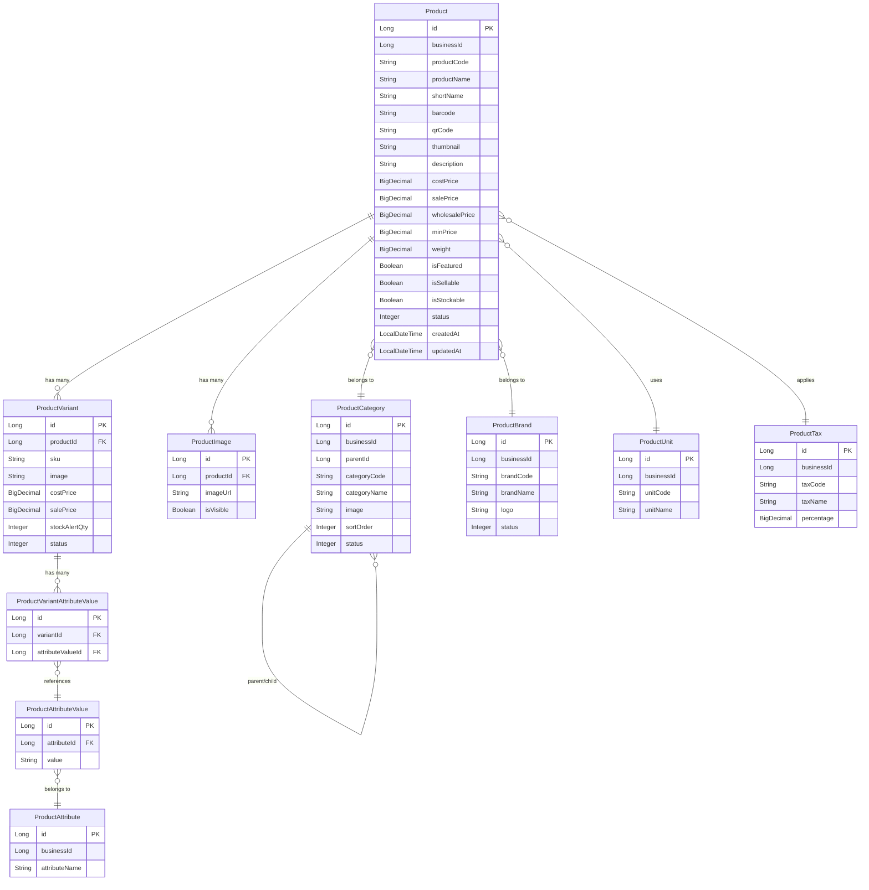

# Vyntra Product Service - Entity Relationship Diagram

This diagram illustrates the relationships between the entities within the Vyntra Product Service.

## Relationship Summary
1.  **Product** is the central entity.
2.  A **Product** can have multiple **ProductVariants** (e.g., different sizes or colors).
3.  A **Product** can have multiple **ProductImages**.
4.  **Product** links to **ProductCategory**, **ProductBrand**, **ProductUnit**, and **ProductTax**.
5.  **ProductCategory** supports a hierarchical structure via `parentId`.
6.  **ProductVariants** are linked to specific **ProductAttributeValues** (like "Red", "Large") through the **ProductVariantAttributeValue** join table.
7.  **ProductAttributeValues** belong to a **ProductAttribute** (like "Color", "Size").
